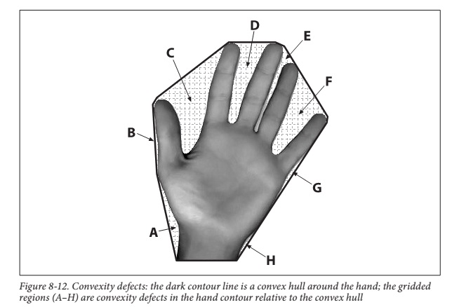

---

如上图所示，黑色的轮廓线为convexity hull, 而convexity hull与手掌之间的部分为convexity defects，即凸缺陷. 每个convexity defect区域有四个特征量：起始点（startPoint），结束点(endPoint)，距离convexity hull最远点(farPoint)，最远点到convexity hull的距离(depth)。

---